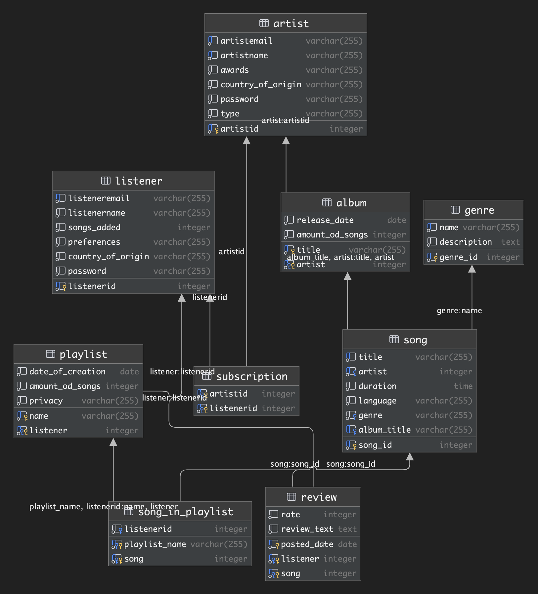
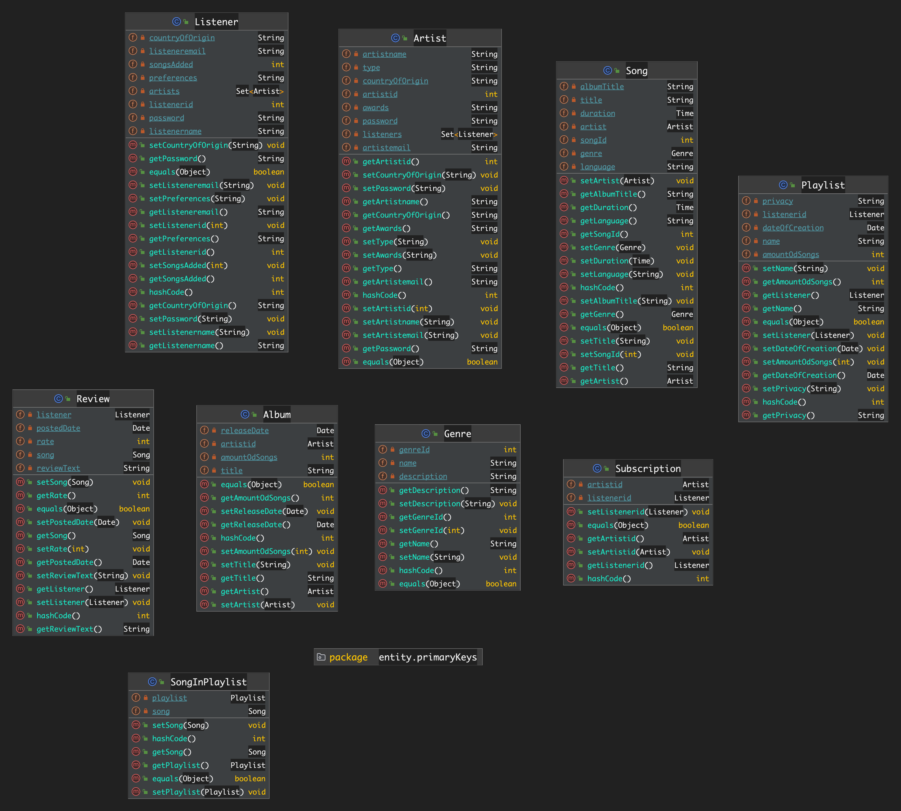

# music-platform-database
SQL Database for music streaming service
**Here is the Java program that interacts with a database using the Jakarta Persistence API (JPA). It performs various operations such as inserting, updating, and deleting records in the database. Database type that was used in a project is postgresql.** 

**Relations model**

**Entities**

